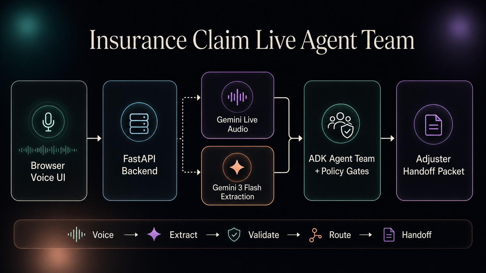

# Insurance Claim Live Agent Team

A voice-first insurance claim intake app that lets a claimant talk naturally while the agent builds a structured claim packet in real time. The UI shows the live conversation, extracted claim facts, operator guidance, missing items, and an adjuster-ready handoff.

This is designed as a realistic first notice of loss (FNOL) workflow: the claimant does not need to fill out a rigid form, and the operator does not need to manually translate a messy conversation into claim fields.

## Features

### Voice + Text Claim Intake

- Native voice conversation with the claim intake agent
- Real-time transcript for claimant and agent turns
- Text input fallback for typed claim details
- Live audio responses from the agent

### Real-Time Claim Packet

- Automatically extracts claimant name, contact method, policy number, loss type, date, location, description, safety details, evidence, and report numbers
- Updates the claim state as the conversation progresses
- Highlights missing or uncertain information
- Builds an adjuster handoff packet while the call is still happening

### Operator Guidance

- Shows the current claim disposition
- Suggests the next best question or confirmation
- Lists blocking items before handoff
- Separates the operator-facing summary from the lower-level audit trail

### Insurance-Specific Routing

- Handles home water damage, auto collision, theft/property loss, travel claims, medical reimbursement examples, and unclear claims
- Applies deterministic evidence and document checks
- Flags injury, safety, habitability, timing, SIU, and escalation signals
- Avoids promising coverage, payment, or liability

## App Engine

The app combines live voice, an ADK graph, structured extraction, and deterministic insurance rules:

| Layer | Model / Engine | Purpose |
| --- | --- | --- |
| Live voice | `gemini-3.1-flash-live-preview` | Voice-to-voice conversation, audio responses, and transcription |
| ADK graph | `root_agent` in `agent.py` | Source of truth for claim normalization, classification, validation, routing, and packet generation |
| Structured extraction | `gemini-3-flash-preview` | Converts messy claim language into structured claim facts inside the ADK graph |
| Business rules | Python FunctionNodes + Pydantic | Deterministic missing-field checks, evidence gates, safety routing, SIU signals, and handoff packet output |
| App backend | FastAPI | Serves the frontend, manages WebSocket audio, and calls `run_claim_workflow()` from `agent.py` after each claimant turn |
| Frontend | HTML, CSS, JavaScript | Dark professional live cockpit for voice, transcript, claim state, and handoff |

## How It Works

`agent.py` owns the production claim workflow. It exposes the ADK `root_agent` and a `run_claim_workflow()` helper that runs the graph programmatically for the live app.

`server.py` owns the live web transport. It manages the browser session, Gemini Live audio stream, transcripts, and FastAPI routes. It does not duplicate extraction, classification, evidence, routing, or packet logic.

The live app flow is:

```text
Claimant speaks or types
        |
        v
server.py captures the turn
        |
        v
run_claim_workflow() executes root_agent
        |
        v
ADK graph runs LLM nodes + deterministic FunctionNodes
        |
        v
server.py renders the returned claim state in the UI
```

## Architecture



## Project Structure

```text
insurance_claim_live_agent_team/
|-- agent.py
|-- schemas.py
|-- policies.py
|-- examples.py
|-- requirements.txt
|-- .env.example
|-- assets/
|   `-- insurance-claim-live-agent-team-architecture.png
|-- live_demo/
|   |-- index.html
|   |-- styles.css
|   |-- app.js
|   `-- server.py
`-- README.md
```

## How to Get Started

From the app directory:

```bash
cd voice_ai_agents/insurance_claim_live_agent_team
python3.12 -m venv .venv
source .venv/bin/activate
pip install -r requirements.txt
cp .env.example .env
```

Edit `.env` and set your Google API key:

```bash
GOOGLE_GENAI_USE_VERTEXAI=False
GOOGLE_API_KEY=your-google-api-key
```

## Run the App

Start the backend and frontend server:

```bash
python -m uvicorn live_demo.server:app --reload --host 127.0.0.1 --port 4177
```

Open the app:

```text
http://127.0.0.1:4177/index.html
```

Use the microphone button to start a live claim conversation, or type into the text box if microphone access is unavailable.
